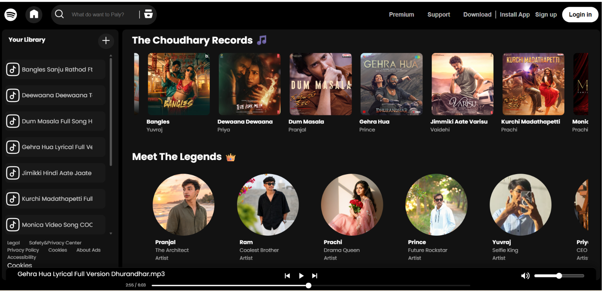

# 🎵 Spotify Clone

A Spotify-inspired music player built using HTML, CSS, and JavaScript.

## 🚀 Features

- Play/Pause songs
- Next/Previous controls
- Volume control
- Seekbar progress tracking
- Responsive design
- Artist section
- Dynamic song loading

## 🛠️ Technologies Used

- HTML5
- CSS3
- JavaScript

## 📸 Screenshots

### Home Page


### Mobile Home Page


## 📂 Project Structure

```text
Spotify-Clone/
│
├── index.html
├── style.css
├── script.js
├── Songs/
├── Images/
├── Screenshots/
└── Svg/
```

## 🔧 Installation

1. Clone the repository

```bash
git clone https://github.com/PranjalChoudhary0702/Spotify-Clone.git
```

2. Open the project folder

```bash
cd Spotify-Clone
```

3. Run using Live Server or any local server.

## 🎯 Future Improvements

- Playlist support
- Search functionality
- User authentication
- Dark/Light themes

## 👨‍💻 Author
Pranjal Choudhary


